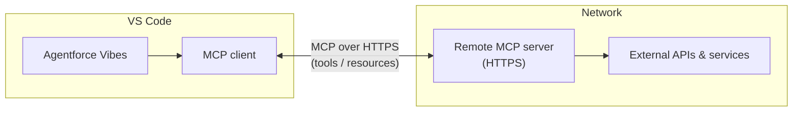
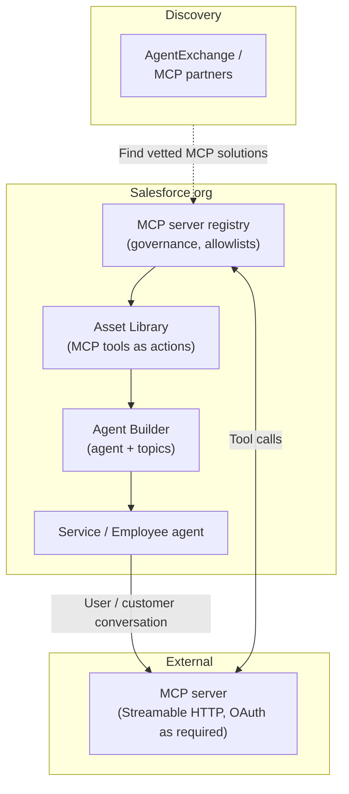
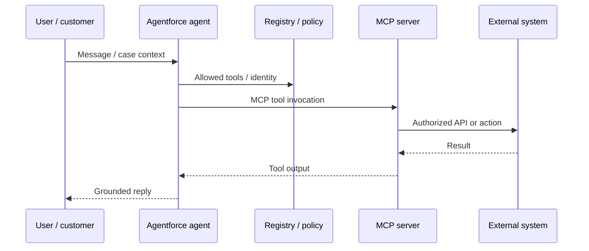

# Salesforce-Agentforce-MCP-Integration-Guide

This guide covers **two common ways** to use MCP with Agentforce:

1. **Agentforce Vibes (developers in VS Code)** — connect to **remote MCP servers** from the extension’s MCP client.
2. **Agentforce Service / Employee agents (in your Salesforce org)** — register MCP servers and expose **tools** to agents through **Agent Builder**, the **MCP server registry**, and **topic actions** (admin / builder flow).

MCP extends Agentforce beyond built-in tools so agents can call external services, APIs, and partner platforms through a standard protocol.

---

## Official references

### Core documentation

- [Connect to Remote MCP Servers](https://developer.salesforce.com/docs/platform/einstein-for-devs/guide/devagent-mcpservers.html) — **Agentforce Vibes**: remote MCP in VS Code
- [MCP Solutions for Developers](https://developer.salesforce.com/docs/einstein/genai/guide/mcp.html) — catalog of Salesforce-related MCP solutions (same content as [Agentforce Developer Guide — MCP](https://developer.salesforce.com/docs/ai/agentforce/guide/mcp.html))
- [Build with Agentforce (Agentforce Vibes overview)](https://developer.salesforce.com/docs/platform/einstein-for-devs/guide/devagent-overview.html)
- [Introducing MCP Support Across Salesforce](https://developer.salesforce.com/blogs/2025/06/introducing-mcp-support-across-salesforce) — MCP stack (host / client / server), governance, **enterprise MCP server registry**, and roadmap context

### Service agents, registry, and discovery (org)

- [Agentforce MCP Support](https://www.salesforce.com/agentforce/mcp-support/) — **centralized MCP server registry**, security/governance, resources/tools/prompts, FAQ (e.g. connecting AI agents via **AgentExchange** and **Agent Builder**)
- [AgentExchange](https://agentexchange.salesforce.com/) — curated catalog to discover MCP-related solutions
- [Agentforce MCP partners (AppExchange collection)](https://appexchange.salesforce.com/collections/agentforce-mcp)
- [Agent Builder](https://www.salesforce.com/agentforce/agent-builder/) — build and configure agents (including adding capabilities from your org’s library)
- [Salesforce Hosted MCP Servers](https://help.salesforce.com/s/articleView?id=platform.hosted_mcp_servers.htm&type=5) (Help, Beta) — hosted MCP access to Salesforce APIs for assistants

### Video

- [How Agentforce MCP support connects agents to your environment](https://www.youtube.com/watch?v=59O48XLPFYI) (YouTube)
- [Agentforce AMA: Supercharge Development with MCP](https://www.youtube.com/watch?v=tOTC-2ygJBM) (YouTube, linked from Salesforce MCP docs)

### Community walkthrough (Setup UI detail)

Salesforce’s product pages describe **registry**, **AgentExchange**, and **Agent Builder** at a high level. For **click-path-level** instructions (Setup → Agentforce Registry, planner updates, Asset Library), many teams use this **third-party** tutorial: [Connect an MCP Server to a Salesforce Agentforce Agent — InfallibleTechie](https://www.infallibletechie.com/2026/03/connect-an-mcp-server-to-a-salesforce-agentforce-agent.html). **Verify field names, planner types, and menu labels in your org and release** before applying in production.

---

## What you are connecting

| Piece | Role |
|--------|------|
| **Agentforce Vibes** | Development agent in **VS Code**; MCP client in the extension |
| **Service / Employee agent** | **Org** agent configured in **Agent Builder**; uses registered tools (including MCP) on topics |
| **MCP client** | Inside the host (Vibes or Agentforce runtime) — discovers and invokes MCP tools |
| **Remote / registered MCP server** | HTTPS MCP endpoint exposing **tools** and **resources** (partner, custom, or hosted) |
| **MCP server registry** | **Central governance** in the org for which MCP servers and tools are allowed ([overview](https://www.salesforce.com/agentforce/mcp-support/)) |

### Developer flow (Agentforce Vibes + VS Code)



### Org flow (Service / Employee agent)





---

## Part A — Prerequisites (Vibes / VS Code)

1. **Visual Studio Code** installed.
2. **Agentforce Vibes** extension installed and signed in per your environment.
3. A **remote MCP server URL** you trust (full HTTPS endpoint per provider).
4. **API keys / OAuth tokens** if required by that server.

> **Security:** Remote MCP servers can execute actions in connected systems. Only add servers from trusted providers. See [Connect to Remote MCP Servers](https://developer.salesforce.com/docs/platform/einstein-for-devs/guide/devagent-mcpservers.html).

---

## Part B — Agentforce Vibes: connect a remote MCP server (VS Code)

Steps follow [Salesforce: Connect to Remote MCP Servers](https://developer.salesforce.com/docs/platform/einstein-for-devs/guide/devagent-mcpservers.html).

### Step B1 — Open Agentforce in VS Code

1. Open **VS Code**.
2. In the **Activity Bar**, click the **Agentforce** icon.

**Screenshot:** `docs/screenshots/01-agentforce-activity-bar.png`

```markdown

```

### Step B2 — Open the MCP Servers UI

1. In the **Agentforce** panel, open the **MCP Servers** UI (control in the **top-right** of the panel per Salesforce docs).

**Screenshot:** `docs/screenshots/02-mcp-servers-button.png`

Tabs typically include **Marketplace**, **Remote Servers**, and **Installed**.

### Step B3 — Add a remote server

1. Open **Remote Servers**.
2. **Server name** — unique and descriptive.
3. **Server URL** — full MCP HTTPS URL from the provider.
4. Click **Add Server**.

**Screenshot:** `docs/screenshots/03-remote-server-form.png`

### Step B4 — Confirm status on Installed

| Indicator | Meaning |
|-----------|--------|
| Green | Connected |
| Yellow | Connecting / warnings |
| Red | Error / disconnected |

**Screenshot:** `docs/screenshots/04-installed-status.png`

### Step B5 — Server settings (optional)

- **Tools and resources** — review tools; use **auto-approval** only for trusted tools.
- **Request timeout** — adjust for latency (docs describe a wide range, e.g. tens of seconds up to an hour depending on UI).
- **Retry / Enable / Disable / Delete** — as needed.

**Screenshot:** `docs/screenshots/05-server-settings.png`

### Step B6 — Verify with prompts

Use prompts that exercise a **read-only** tool first, then mutating tools when safe.

---

## Part C — Agentforce Service / Employee agents: MCP in the org

This path is for **agents that run in Salesforce** (e.g. service or employee use cases) and need **external MCP tools** under **enterprise controls**. Salesforce describes **resources**, **tools**, and **prompts** exposed via MCP, plus a **centralized MCP server registry** and governance on [Agentforce MCP Support](https://www.salesforce.com/agentforce/mcp-support/). The [Introducing MCP Support Across Salesforce](https://developer.salesforce.com/blogs/2025/06/introducing-mcp-support-across-salesforce) blog explains the **host / client / server** model and **registry** for authorized tools.

### Step C1 — Discover an MCP solution

1. Browse **[AgentExchange](https://agentexchange.salesforce.com/)** and the **[Agentforce MCP collection on AppExchange](https://appexchange.salesforce.com/collections/agentforce-mcp)** for vetted or partner MCP offerings.
2. Confirm **technical fit**: Salesforce frequently references **Streamable HTTP** transport and **OAuth 2.0** where authentication is required (see also the requirements summary in the [InfallibleTechie guide](https://www.infallibletechie.com/2026/03/connect-an-mcp-server-to-a-salesforce-agentforce-agent.html)).

### Step C2 — Register the MCP server (registry)

Per Salesforce’s positioning, admins use an org-level **registry** so only **authorized** MCP servers and tools are discoverable ([Agentforce MCP Support](https://www.salesforce.com/agentforce/mcp-support/)).

Operational clicks vary by release. A common pattern documented in the community is:

1. **Setup** → search **Agentforce Registry** (or equivalent).
2. **New** → wizard: server endpoint, connection, and **tool allowlist**.

**Screenshot (optional):** `docs/screenshots/06-setup-agentforce-registry.png`

```markdown

```

> **Permission sets / identity:** Community write-ups note that registering a server can create **Named Credential**, **External Credential**, and a **permission set** used for outbound auth. Assign that permission set to users (or the agent identity) who must **invoke** the tools — see [InfallibleTechie — security note](https://www.infallibletechie.com/2026/03/connect-an-mcp-server-to-a-salesforce-agentforce-agent.html).

### Step C3 — Planner / orchestration (if required)

Some orgs must align the agent **planner** with multi-agent / MCP orchestration. Community tutorials describe updating `GenAiPlannerDefinition.PlannerType` to `Atlas__ConcurrentMultiAgentOrchestration` via SOQL and the Salesforce CLI, for example:

```text
sf data update record -s GenAiPlannerDefinition -i <GenAiPlannerDefinition_ID> -v PlannerType=Atlas__ConcurrentMultiAgentOrchestration
```

**Always** identify the correct `GenAiPlannerDefinition` row (e.g. by `DeveloperName`), test in a **sandbox**, and confirm against **current** Salesforce documentation for your edition — metadata/setup objects may require **Tooling API** or CLI rather than standard DML. Details: [InfallibleTechie — Step 1](https://www.infallibletechie.com/2026/03/connect-an-mcp-server-to-a-salesforce-agentforce-agent.html).

### Step C4 — Add MCP tools to the agent (topics / actions)

1. Open the agent in **[Agent Builder](https://www.salesforce.com/agentforce/agent-builder/)** (or your org’s agent configuration UI).
2. Create or select a **Topic** that should own the capability.
3. Under **This Topic’s Actions** (or equivalent), use **Add from Asset Library** (or equivalent) to attach the **registered MCP tool** as an action.

**Screenshot (optional):** `docs/screenshots/07-topic-actions-asset-library.png`

```markdown

```

### Step C5 — Test and debug

- Test from the **Agentforce builder** / preview channels your org supports.
- For troubleshooting, community guides suggest inspecting **mcp_request** / **mcp_response** style fields in action diagnostics where available — see [InfallibleTechie — testing](https://www.infallibletechie.com/2026/03/connect-an-mcp-server-to-a-salesforce-agentforce-agent.html).

### Hosted Salesforce data via MCP (related)

For assistants that need **Salesforce data** through MCP without your own server, see **[Salesforce Hosted MCP Servers](https://help.salesforce.com/s/articleView?id=platform.hosted_mcp_servers.htm&type=5)** (Beta; product terms apply).

---

## Troubleshooting

### Remote server (Vibes)

1. **URL** exactness (scheme, host, path).
2. **Network** — VPN, proxy, firewall.
3. **Retry connection** in the Installed server panel.
4. **Auth** — token scope, method, and headers per provider.

### Service agent (org)

1. **Registry** — server registered and tools allowlisted.
2. **Credentials** — named/external credentials valid; **permission sets** assigned.
3. **Transport** — MCP server reachable with **Streamable HTTP** (and OAuth if required).
4. **Planner / agent type** — confirm your org still requires planner updates for MCP (see Part C3).

### Still stuck

- [MCP Solutions for Developers](https://developer.salesforce.com/docs/einstein/genai/guide/mcp.html)
- [modelcontextprotocol.io](https://modelcontextprotocol.io/introduction)
- [YouTube — Agentforce MCP](https://www.youtube.com/watch?v=59O48XLPFYI)

---

## Repository layout for screenshots

```text
.
├── README.md
└── docs
    └── screenshots
        ├── 01-agentforce-activity-bar.png
        ├── 02-mcp-servers-button.png
        ├── 03-remote-server-form.png
        ├── 04-installed-status.png
        ├── 05-server-settings.png
        ├── 06-setup-agentforce-registry.png   (optional, org flow)
        └── 07-topic-actions-asset-library.png (optional, org flow)
```

---

## License / disclaimer

This README summarizes public Salesforce pages, the MCP standard, and one labeled **community** tutorial. UI labels, Setup names, pilot/GA status, and CLI/SOQL details **change by release** — always confirm in your org and in the latest **Salesforce Help** and **Salesforce Developers** documentation. This document is not an official Salesforce publication.
