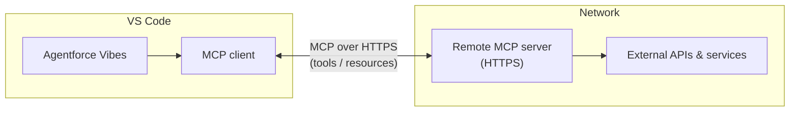
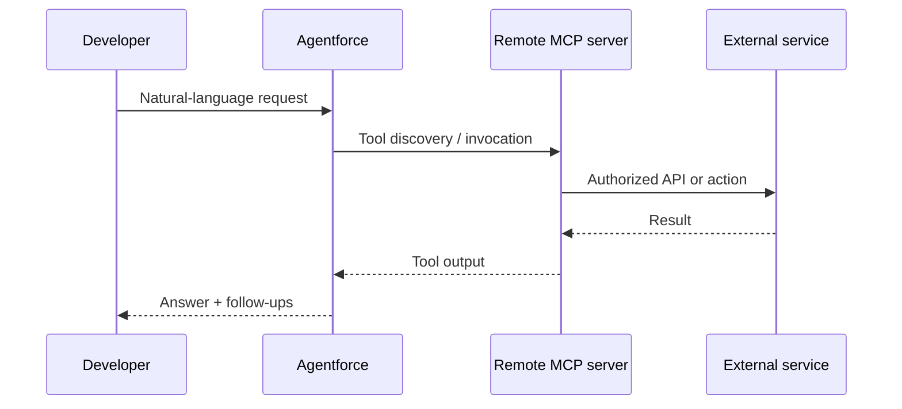

# Salesforce-Agentforce-MCP-Integration-Guide

This guide walks through connecting **Agentforce** in **Visual Studio Code** to **remote MCP servers** using the **Agentforce Vibes** extension. MCP extends Agentforce beyond built-in Salesforce tools so your agent can call external services, APIs, and third-party platforms through a standard protocol.

**Official references**

- [Connect to Remote MCP Servers](https://developer.salesforce.com/docs/platform/einstein-for-devs/guide/devagent-mcpservers.html) — Salesforce Developers (primary source for the steps below)
- [MCP Solutions for Developers](https://developer.salesforce.com/docs/einstein/genai/guide/mcp.html) — overview of Salesforce MCP offerings
- [Build with Agentforce (Agentforce Vibes overview)](https://developer.salesforce.com/docs/platform/einstein-for-devs/guide/devagent-overview.html)
- Video: [How Agentforce MCP support connects agents to your environment](https://www.youtube.com/watch?v=59O48XLPFYI) (YouTube)

---

## What you are connecting

| Piece | Role |
|--------|------|
| **Agentforce (Vibes)** | AI development partner in VS Code; chat + tool use |
| **MCP client** | Built into Agentforce; discovers and invokes MCP tools |
| **Remote MCP server** | HTTPS endpoint that exposes **tools** and **resources** via the Model Context Protocol |
| **Your org / CLI** | Often used together with the optional [Salesforce DX MCP Server](https://developer.salesforce.com/docs/atlas.en-us.sfdx_dev.meta/sfdx_dev/sfdx_dev_mcp.htm) (Beta) for org operations |





---

## Prerequisites

1. **Visual Studio Code** installed.
2. **Agentforce Vibes** extension installed and signed in per Salesforce setup for your environment.
3. A **remote MCP server URL** from a provider you trust (complete HTTPS endpoint as documented by that server).
4. If the server requires **API keys, OAuth tokens, or other auth**, have those ready per the provider’s instructions.

> **Security:** Remote MCP servers can execute actions in connected systems. Only add servers from trusted providers, verify their security practices, and treat credentials like production secrets. See the caution in [Salesforce’s remote MCP guide](https://developer.salesforce.com/docs/platform/einstein-for-devs/guide/devagent-mcpservers.html).

---

## Step 1 — Open Agentforce in VS Code

1. Open **VS Code** (ideally in a folder where you work on Salesforce or your integration).
2. In the **Activity Bar** (vertical icons on the side), click the **Agentforce** icon.

**Screenshot to add**

Save your capture as:

`docs/screenshots/01-agentforce-activity-bar.png`

Then uncomment or add in this README:

```markdown

```

---

## Step 2 — Open the MCP Servers UI

1. With the **Agentforce** panel open, click the **MCP / settings** control in the **top-right** of the panel (Salesforce docs refer to opening the **MCP Servers** interface from there).

**Screenshot to add**

`docs/screenshots/02-mcp-servers-button.png`

```markdown

```

You should see the MCP interface with **tabs** similar to:

| Tab | Purpose |
|-----|--------|
| **Marketplace** | Discover / install pre-configured MCP servers (if enabled for your tenant) |
| **Remote Servers** | Add MCP servers by **URL** |
| **Installed** | Manage connected servers, status, and settings |

---

## Step 3 — Add a remote MCP server

1. Open the **Remote Servers** tab.
2. Enter a **Server name** — short, unique, and descriptive (examples from docs: `GitHub Integration`, `Company Database`).
3. Enter the **Server URL** — the **full endpoint URL** from your MCP provider (must match their documented MCP HTTPS entry point).
4. Click **Add Server**.

**Screenshot to add**

`docs/screenshots/03-remote-server-form.png`

```markdown

```

Agentforce will attempt to connect and show a **connection status**.

---

## Step 4 — Confirm connection status

On the **Installed** tab, use the status indicators (as described in Salesforce docs):

| Indicator | Meaning |
|-----------|--------|
| Green | Connected and ready |
| Yellow | Connecting or warnings |
| Red | Disconnected or error |

**Screenshot to add**

`docs/screenshots/04-installed-status.png`

```markdown

```

---

## Step 5 — Configure server options (optional)

Select a server to expand its settings. Typical options include:

- **Tools and resources** — List available MCP tools; configure **auto-approval** only for tools you fully trust; read parameter docs before enabling.
- **Request timeout** — How long Agentforce waits for the server (range described in docs: on the order of **30 seconds up to 1 hour**, depending on UI options); increase for slow networks or long-running tools.

**Actions**

- **Retry connection** — If the server was temporarily unreachable.
- **Enable / Disable** — Toggle without deleting configuration.
- **Delete server** — Remove the entry.

**Screenshot to add**

`docs/screenshots/05-server-settings.png`

```markdown

```

---

## Step 6 — Verify with prompts

Try simple prompts that force a tool call your server advertises, for example (adapt to your server):

- *“Test the MCP server connection.”*
- *“List available tools from the \<Server name\> MCP server.”*
- Then run a **specific tool** your provider documents (e.g. read-only list/fetch) before trying mutating operations.

---

## Troubleshooting

### Connection failures

1. Confirm the **Server URL** is exact (scheme, host, path, no typos).
2. Confirm the MCP server is **running** and reachable from your machine (VPN, corporate proxy, firewall).
3. Click **Retry connection** after fixing network or URL issues.

### Authentication problems

1. Confirm **API keys / tokens** are valid and not expired.
2. Confirm the identity has the **scopes/permissions** the MCP server expects.
3. Match the **authentication method** to what the provider requires (header names, OAuth flow, etc.).

### Still stuck

- Re-read your provider’s MCP documentation for **Streamable HTTP** / transport requirements.
- Watch the walkthrough: [YouTube — Agentforce MCP](https://www.youtube.com/watch?v=59O48XLPFYI).
- Broader MCP catalog and patterns: [MCP Solutions for Developers](https://developer.salesforce.com/docs/einstein/genai/guide/mcp.html) and [modelcontextprotocol.io](https://modelcontextprotocol.io/introduction).

---

## Related Salesforce MCP options

Beyond custom **remote** servers, Salesforce documents other MCP-related solutions (Heroku, MuleSoft, DX MCP Server, hosted servers). See the table and links on [MCP Solutions for Developers](https://developer.salesforce.com/docs/einstein/genai/guide/mcp.html).

---

## Repository layout for screenshots

```text
.
├── README.md
└── docs
    └── screenshots
        ├── 01-agentforce-activity-bar.png
        ├── 02-mcp-servers-button.png
        ├── 03-remote-server-form.png
        ├── 04-installed-status.png
        └── 05-server-settings.png
```

Add your images under `docs/screenshots/` and uncomment the `` lines above (or paste them where you want images to appear).

---

## License / disclaimer

This README summarizes public Salesforce documentation and standard MCP concepts. Product UI labels and exact menu paths can change; always verify against the latest **Salesforce Developers** pages linked at the top. This document is not an official Salesforce publication.
